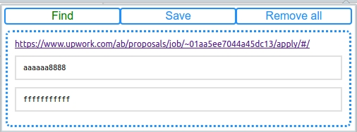
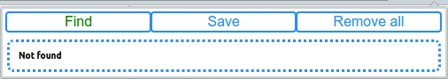
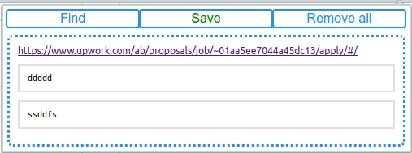

#Chrome Extention Submit Proposal
Face It chrome extention work with local storage
###How to install extention?

- [x] chrome
- [x] settings
- [x] extentions
- [x] check developer mode
- [x] click on: "Download unpakege extention"
- [x] set pas to folder "ChromeExtentionSubmitProposal"

##Usage
###Start menu

###Find

or

###Save

next

###Remove All
Remove all data from local storage and clear popup

